# FonoCare

Aplicativo desenvolvido em Dart, com Framework Flutter. 
Disponível para Android, iOS, Desktop (Windows) e WebApp.
Esse aplicativo está na versão 1.0.

Todo o banco de dados foi feito através do Firebase. Exigindo a internet do dispositivo para utilizar.
Foram utilizados packages do pub.dev.

O aplicativo foi desenvolvido para uma fonoaudióloga. 
Os recursos que ele possui foi implementado de acordo com a necessidade da cliente.
Possui os recursos de:
    - Cadastro Usuário; 
    - Cadastro Paciente; 
    - Anamneses; 
    - Prontuários; 
    - Bloco de Notas; 
    - Contabilidade; 
    - Agenda. 

## Capturas de Tela

### Tela de Login

### Tela de Cadastro

### Tela Iniciais

### Tela Lista de Pacientes
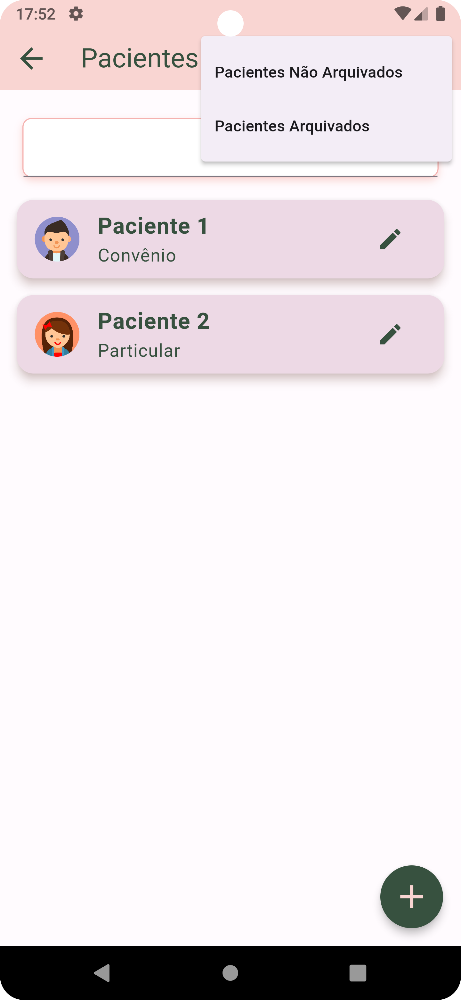

### Tela de Adicionar Pacientes

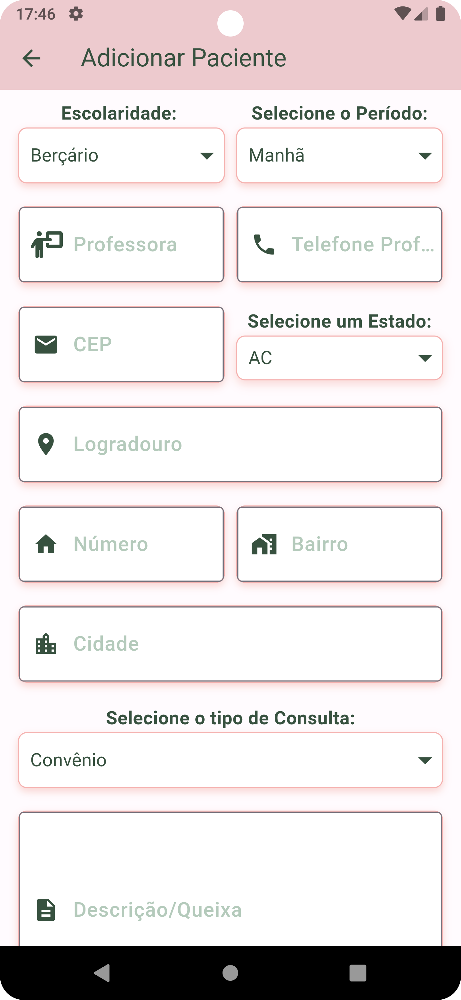
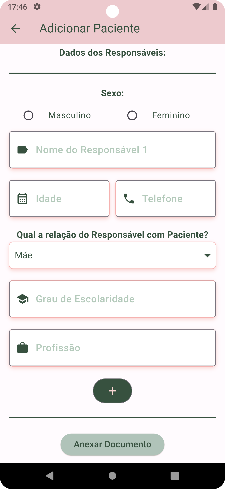

### Tela de Dados do Paciente
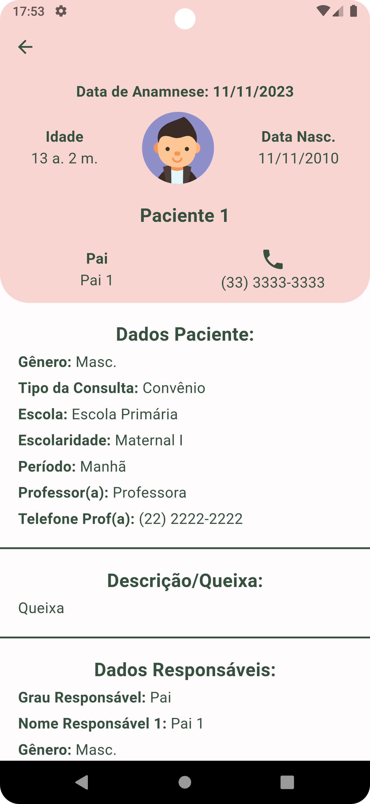

### Tela Agenda
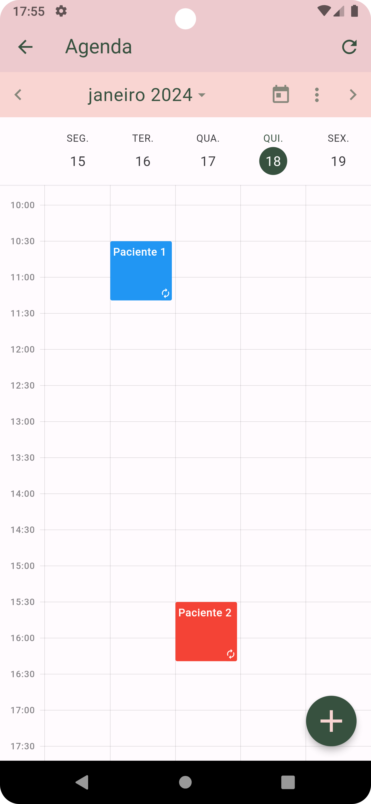

### Tela de Adicionar Agenda
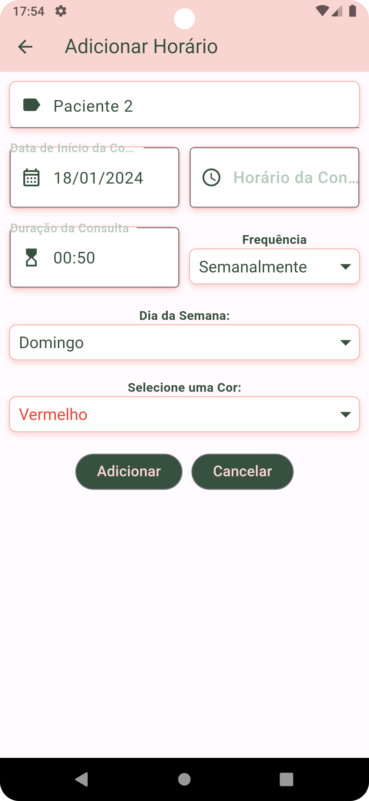

### Tela Lista de Paciente Prontuário
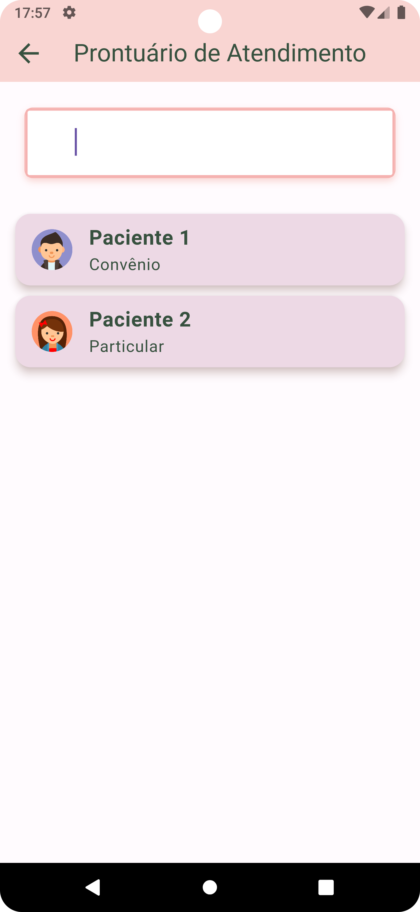

### Tela Lista Prontuário por Paciente
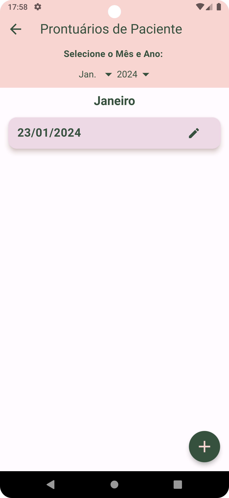

### Tela Prontuário
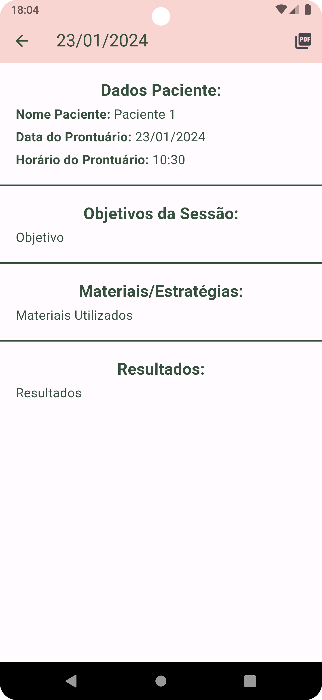

### Tela de Bloco de Notas
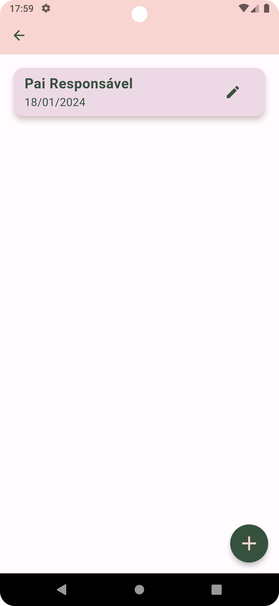

<!-- ### Tela de Adicionar Bloco de Notas
 -->

### Tela de Contabilidade
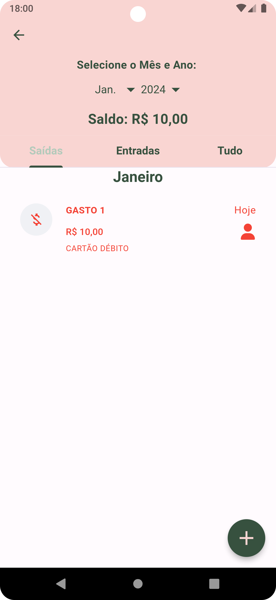
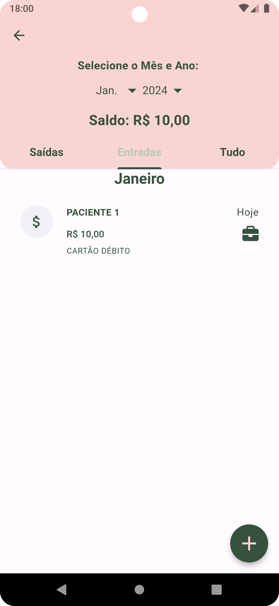

### Tela de Adicionar Contabilidade
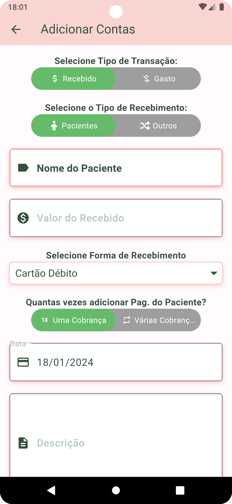
